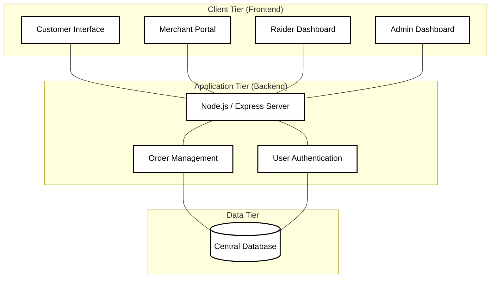

# CodeBite System Architecture

This diagram illustrates the high-level architecture of the CodeBite Food Management Platform in a clean, black-and-white technical format.

### **Architecture Overview**
*   **Frontend**: React-based modular interfaces for each user role.
*   **Backend**: Node.js server managing business logic and API requests.
*   **Database**: Centralized repository for all platform data.
